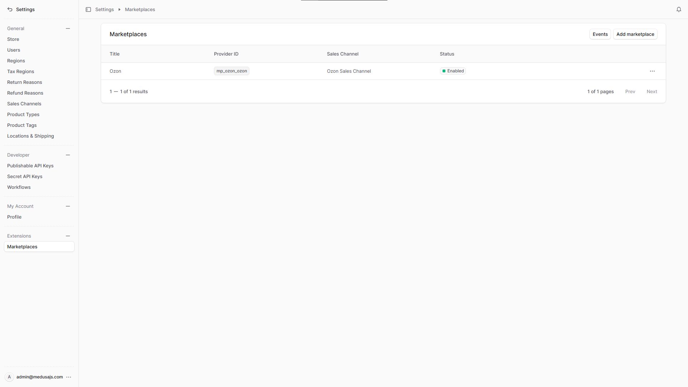
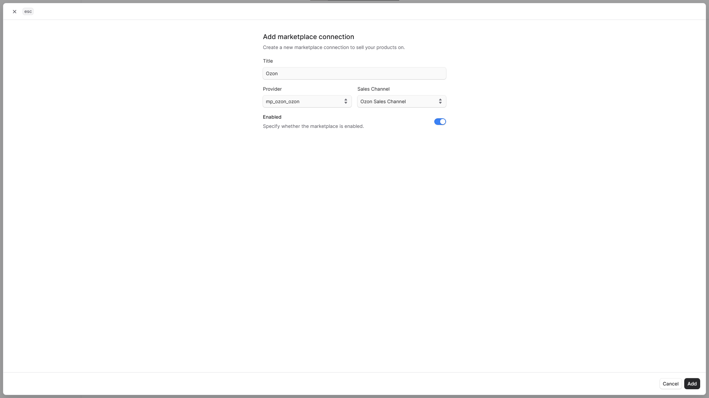

<h1 align="center">
  Интеграция Ozon с Medusa
</h1>

<p align="center">
  Плагин для Medusa, который интегрирует ваш магазин с маркетплейсом <a href="https://www.ozon.ru/">Ozon</a>
  <br/>
  <a href="https://github.com/gorgojs/medusa-plugins/blob/HEAD/packages/medusa-marketplace-ozon/README.md">Read README in English ↗</a>
</p>

<p align="center">
  <a href="https://medusajs.com">
    
  </a>
  <a href="https://medusajs.com">
    
  </a>
</p>

<p align="center">
  <a href="https://t.me/medusajs_chat">
    
  </a>
</p>

<p align="center">
  <a href="https://t.me/medusajs_chat">
    
  </a>
</p>

## Статус

🚧 В разработке, подробнее см. [Roadmap](https://github.com/gorgojs/medusa-plugins/issues/102).

## Возможности

- 🧩 **Построен как провайдер поверх [`@gorgo/medusa-marketplace`](https://www.npmjs.com/package/@gorgo/medusa-marketplace)** с общей админ-панелью, событиями и workflow  
- 🔄 **Синхронизация товаров** с Ozon (создание, обновление, объединение)  
- 📦 **Синхронизация заказов** с автоматическим созданием клиентов и заказов  
- ⏱ **Плановая и ручная синхронизация** через админ-панель  
- 📊 **Логирование событий** для всех операций синхронизации  
- 🛠 **Админ UI** для управления маркетплейсами, доступами и настройками  
- 🔑 **Управление API-ключом** через UI  
- ⚙️ **Профили обмена** — настройка складов и схем FBO/realFBS  

## Требования

- Medusa v2.13.3 или выше
- Node.js v20 или выше
- Core-плагин [@gorgo/medusa-marketplace](https://www.npmjs.com/package/@gorgo/medusa-marketplace)   

## Установка

Установите core-плагин Marketplace и плагин-провайдер Ozon:

```bash
npm install @gorgo/medusa-marketplace @gorgo/medusa-marketplace-ozon
# или
yarn add @gorgo/medusa-marketplace @gorgo/medusa-marketplace-ozon
```

## Конфигурация

Добавьте конфигурацию провайдера в файл `medusa-config.ts` приложения Medusa Admin:

```ts
// medusa-config.ts
import { gorgoPluginsInject } from '@gorgo/medusa-marketplace/exports'

module.exports = defineConfig({
  // ...
  // Регистрация плагинов
  plugins: [
    // ...
    // Регистрация плагина Ozon (добавляет роуты и виджеты в админке)
    {
      resolve: "@gorgo/medusa-marketplace-ozon",
      options: {},
    },
    // Регистрация оcore-плагина marketplace и объявление провайдера Ozon
    {
      resolve: "@gorgo/medusa-marketplace",
      options: {
        providers: [
          {
            resolve: "@gorgo/medusa-marketplace-ozon/providers/marketplace-ozon",
            id: "ozon", // уникальный идентификатор экземпляра провайдера
            options: {},
          },
        ],
      },
    },
  ],
  // ...
  // Настройка Vite-плагина для внедрения marketplace-виджетов
  admin: {
    vite: (config) => {
      return {
        ...config,
        plugins: [
          gorgoPluginsInject({
            sources: [
              "@gorgo/medusa-marketplace",
              "@gorgo/medusa-marketplace-ozon",
            ],
          }),
        ],
        /**
         * Параметры `optimizeDeps` и `resolve` необходимы, чтобы избежать
         * дублирования общих зависимостей (React, React Query, React Router)
         * между Medusa admin и пакетами плагинов.
         */
        optimizeDeps: {
          exclude: ["@gorgo/medusa-marketplace"],
        },
        resolve: {
          alias: [
            { find: /^react$/, replacement: require.resolve("react") },
            { find: /^react-dom$/, replacement: require.resolve("react-dom") },
            { find: /^@tanstack\/react-query$/, replacement: require.resolve("@tanstack/react-query") },
            { find: /^react-router-dom$/, replacement: require.resolve("react-router-dom") },
          ],
          dedupe: ["react", "react-dom", "@tanstack/react-query", "react-router-dom"],
          preserveSymlinks: false,
        },
      }
    },
  },
})
```

Компоненты админ-интерфейса внедряются в Medusa Admin с помощью Vite-плагина.

**Параметры плагина `@gorgo/medusa-marketplace`:**

| Параметр              | Тип      | Обязательный | Описание                                                                                                                                  |
| --------------------- | -------- | ------------ | ----------------------------------------------------------------------------------------------------------------------------------------- |
| `providers`           | `array`  | Yes          | Список регистраций провайдеров маркетплейсов                                                                                              |
| `providers[].resolve` | `string` | Yes          | Путь к модулю провайдера. Для Ozon: `"@gorgo/medusa-marketplace-ozon/providers/marketplace-ozon"`                                        |
| `providers[].id`      | `string` | Yes          | Уникальный идентификатор экземпляра провайдера (например, `"ozon"`), используется для различения нескольких подключений                  |
| `providers[].options` | `object` | No           | Параметры уровня провайдера (для Ozon не используются)                                                                                       |

**Параметры плагина `@gorgo/medusa-marketplace-ozon`:**

Передача опций на уровне регистрации плагина не требуется. Все настройки маркетплейса (например, API‑ключ) задаются отдельно для каждого подключения в Medusa Admin.

**Параметры Vite‑плагина `gorgoPluginsInject`:**

| Параметр  | Тип       | Описание                                                                                                                                                   |
| --------- | ----------| ---------------------------------------------------------------------------------------------------------------------------------------------------------- |
| `sources` | `string[]`| Список пакетов Gorgo‑плагинов, чьи расширения админ‑интерфейса должны быть внедрены в Medusa Admin. Укажите все установленные `@gorgo/medusa-marketplace-*` |

## Разработка

Для генерации [клиента Ozon OpenAPI](https://openapi-generator.tech/docs/installation/) требуется Docker. Чтобы (пере)сгенерировать клиент, выполните:

```bash
yarn
yarn openapi:pull  # загрузить актуальную схему Ozon OpenAPI
yarn openapi:gen   # сгенерировать API‑клиент
```

Клиент также автоматически пересобирается при запуске `yarn dev`.

## Лицензия

MIT

## Использование

Эта документация описывает, как управлять интеграциями с маркетплейсом Ozon из панели управления Medusa.

### Управление маркетплейсами

В этом разделе вы узнаете, как управлять маркетплейсами в Medusa Admin.

#### Просмотр списка маркетплейсов

Перейдите в **Settings → Marketplaces**, чтобы увидеть таблицу всех настроенных интеграций маркетплейсов.



Таблица содержит:

| Колонка         | Описание                                                                 |
| --------------- | ------------------------------------------------------------------------ |
| **Title**       | Отображаемое имя, которое вы задали маркетплейсу                        |
| **Provider**    | Тип маркетплейса (например, `ozon`)                                     |
| **Sales Channel** | Канал продаж Medusa, связанный с этим маркетплейсом                   |
| **Status**      | Включён или выключен данный маркетплейс                                 |

---

#### Добавление маркетплейса

1. Перейдите в **Settings → Marketplaces**.
2. Нажмите **Add**, чтобы создать новое подключение.
3. Заполните форму:
   - **Title** — человеко‑читаемое имя подключения (например, `Ozon Main Store`).
   - **Provider** — выберите `mp_ozon_ozon` в выпадающем списке.
   - **Sales Channel** — выберите канал продаж Medusa, к которому будут относиться товары и заказы.
   - **Enabled** — включите или отключите подключение.
4. Нажмите **Save**, чтобы создать маркетплейс.



> После создания настройте разделы **Credentials** и **Exchange settings** перед запуском синхронизации.

---

#### Просмотр деталей маркетплейса

Нажмите на маркетплейс в списке, чтобы открыть страницу его настроек. Страница разделена на несколько секций:

- **General** — название и статус включения.
- **Exchange Profiles** — привязка складов и типов заказов.
- **Events** — журнал всех операций синхронизации для этого маркетплейса.
- **Credentials** — ваш API‑ключ Ozon и Client ID (предоставляется виджетом провайдера Ozon).

![settings.marketplaces.[id]](../../www/docs/public/static/marketplace-ozon/image-3.png)

---

#### Редактирование маркетплейса

1. На странице маркетплейса найдите секцию **General**.
2. Нажмите иконку **Edit** (карандаш).
3. Обновите **Title** или переключите **Enabled**.
4. Нажмите **Save**.

![settings.marketplace.[id].edit](../../www/docs/public/static/marketplace-ozon/image-4.png)

---

### Управление учётными данными маркетплейса

В этом разделе вы узнаете, как управлять учётными данными Ozon в Medusa Admin.

#### Редактирование учётных данных

Секция **Credentials** добавляется виджетом `@gorgo/medusa-marketplace-ozon` на странице маркетплейса.

1. Найдите секцию **Credentials** на странице маркетплейса.
2. Текущий API‑ключ отображается в скрытом виде (видны только первые 4 и последние 2 символа).
3. Нажмите иконку глаза, чтобы временно показать полный ключ, или иконку копирования, чтобы скопировать его.
4. Нажмите иконку **Edit** (карандаш), чтобы открыть форму редактирования.
5. Введите ваш [API‑ключ Ozon](https://seller.ozon.ru/app/settings/api-keys) в поле **API Key**.
6. Введите ваш **Client ID** в поле **Client ID** (его можно найти в личном кабинете продавца Ozon).
7. Нажмите **Save**.

![settings.marketplace.[id].credentials.edit](../../www/docs/public/static/marketplace-ozon/image-5.png)

> API‑ключ и Client ID сохраняются в базе данных и по умолчанию никогда не отображаются в интерфейсе в открытом виде.

---

### Управление параметрами обмена

В этом разделе вы узнаете, как управлять настройками обмена с Ozon в Medusa Admin.

#### Редактирование параметров обмена

Параметры обмена связывают **склад** и **тип заказов** (realFBS, FBO). Без этого синхронизация заказов невозможна.

1. Найдите секцию **Exchange settings** на странице маркетплейса.
2. Нажмите **Add** (или иконку редактирования у уже существующего профиля).
3. Выберите:
   - **Warehouse** — склад из списка, загружаемого в режиме реального времени из вашего аккаунта Ozon.
   - **Order Type** — `realFBS` (Fulfilled by Seller) или `FBO` (Fulfilled by Operator).
4. Нажмите **Save**.

![settings.marketplace.[id].exchange-profile.edit](../../www/docs/public/static/marketplace-ozon/image-6.png)

> Список складов загружается по API Ozon, используя сохранённые учётные данные. Убедитесь, что Credentials настроены перед добавлением профиля обмена.

---

### Управление маппингом категорий

В этом разделе вы узнаете, как управлять маппингом категорий и атрибутов между Medusa и Ozon.

#### Создание маппинга категорий

1. В секции **Category mapping** нажмите **Add**.
2. В модальном окне **Create Category Mapping**:
   - Выберите **Medusa Category**, которую нужно экспортировать в Ozon.
   - Выберите **Ozon Category**.
   - Выберите **Ozon Subcategory**.
3. После выбора подкатегории Ozon автоматически загрузится секция **Attributes Mapping** для этой подкатегории.
4. Настройте маппинг атрибутов по необходимости.
5. Нажмите **Save**.

![settings.marketplace.[id].category-mapping.add](../../www/docs/public/static/marketplace-ozon/image-7.png)

#### Редактирование маппинга категорий

1. Перейдите в **Settings → Marketplaces** и выберите маркетплейс Ozon.
2. В таблице **Category mapping** найдите нужный маппинг.
3. Нажмите меню **...** в соответствующей строке.
4. Выберите **Edit**.
5. В модальном окне при необходимости обновите:
   - **Medusa Category**, **Ozon Category** или **Ozon Subcategory**;
   - конфигурацию **Attributes Mapping** (источники полей Medusa, значения по умолчанию и стратегии обработки значений).
6. Нажмите **Save**.

![settings.marketplace.[id].category-mapping.edit](../../www/docs/public/static/marketplace-ozon/image-8.png)

Вы также можете добавить маппинг для дополнительных (необязательных) атрибутов, нажав **Add rule** в секции атрибутов.

> При включённом маркетплейсе в Ozon выгружаются только товары из тех категорий Medusa, для которых настроен маппинг. Пэйлоады формируются на основе выбранных категорий и настроек маппинга атрибутов.

---

### Синхронизация товаров

Товары могут синхронизироваться в обоих направлениях:

- **Экспорт** — товары из Medusa отправляются в Ozon. Для товаров, подходящих под правила маппинга категорий, варианты преобразуются в офферы Ozon с идентификаторами, ценами, габаритами, штрихкодами, изображениями, НДС и другими сопоставленными атрибутами.
- **Импорт** — атрибуты товаров Ozon запрашиваются по offer ID и записываются в метаданные соответствующих товаров и вариантов в Medusa.

После успешного импорта могут быть заполнены следующие поля метаданных:

| Ключ метаданных                 | Описание                                                       |
| --------------------------------| -------------------------------------------------------------- |
| `variant.metadata.ozon_product_id` | Идентификатор оффера Ozon, сохранённый на варианте           |
| `product.metadata.ozon_type_id`    | Идентификатор типа товара Ozon, сохранённый на продукте      |
| `variant.metadata.ozon_barcodes`   | Массив штрихкодов, возвращённых Ozon для варианта            |

---

#### Ручная синхронизация товаров

1. На странице маркетплейса нажмите **Synchronize**.
2. Выберите **Products** в выпадающем списке.
3. Синхронизация будет выполнена в фоне. Отслеживайте прогресс и результаты в секции **Events**.

![settings.marketplace.[id].sync-products](../../www/docs/public/static/marketplace-ozon/image-9.png)

---

#### Плановая синхронизация товаров

Синхронизация товаров выполняется автоматически каждый день в полночь (UTC) фоновым заданием `sync-marketplace-products`. Дополнительная настройка не требуется.

---

### Синхронизация заказов

Заказы импортируются из Ozon в Medusa. Для каждого заказа Ozon создаются соответствующий заказ и клиент в Medusa (если они ещё не существуют). Повторные заказы автоматически пропускаются.

---

#### Ручная синхронизация заказов

1. На странице маркетплейса нажмите **Synchronize**.
2. Выберите **Orders** в выпадающем списке.
3. Синхронизация будет выполнена в фоне. Прогресс и результаты доступны в секции **Events**.

![settings.marketplace.[id].sync-orders](../../www/docs/public/static/marketplace-ozon/image-9.png)

---

#### Плановая синхронизация заказов

Синхронизация заказов выполняется автоматически каждый день в полночь (UTC) фоновым заданием `sync-marketplace-orders`. Дополнительная настройка не требуется.

---

#### Удаление маркетплейса

1. На странице маркетплейса откройте меню действий.
2. Нажмите **Delete**.
3. Подтвердите удаление.

![settings.marketplace.[id].sync-orders](../../www/docs/public/static/marketplace-ozon/image-10.png)

> При удалении маркетплейса также безвозвратно удаляются все связанные профили обмена и события.

---

#### Просмотр событий

Перейдите в **Settings → Marketplaces → Events**, чтобы увидеть журнал всех операций синхронизации по всем маркетплейсам. События, относящиеся к одному маркетплейсу, также отображаются на его странице.

![settings.marketplace.[id].events](../../www/docs/public/static/marketplace-ozon/image-11.png)

Таблица событий содержит:

| Колонка       | Описание                                                                                       |
| ------------- | ---------------------------------------------------------------------------------------------- |
| **Direction** | Направление: `Medusa → Marketplace` (экспорт) или `Marketplace → Medusa` (импорт)             |
| **Entity**    | Что синхронизировалось: `PRODUCT`, `PRODUCT_MEDIA`, `PRODUCT_PRICE`, `PRODUCT_STOCK`, `ORDER` |
| **Action**    | Тип операции: `CREATE`, `UPDATE` или `DELETE`                                                  |
| **Started**   | Время начала операции                                                                          |
| **Finished**  | Время завершения операции                                                                      |

---

#### Детали события

Нажмите на любое событие в списке, чтобы открыть детальный просмотр. Отображаются:

- **Correlation ID** — идентификатор, объединяющий связанные события одного запуска.
- **Direction**, **Entity type** и **Action**.
- Временные метки **Started at** / **Finished at**.
- **Request data** — полный запрос, отправленный в Ozon или полученный от него (JSON).
- **Response data** — полный ответ Ozon (JSON), включая возможные ошибки валидации.

![settings.marketplace.[id].events](../../www/docs/public/static/marketplace-ozon/image-12.png)

> Детали событий помогают диагностировать проблемы с синхронизацией. Ошибки валидации для отдельных товарных карточек сохраняются в поле **Response data**, а также записываются в метаданные `ozon_error` соответствующих вариантов.
