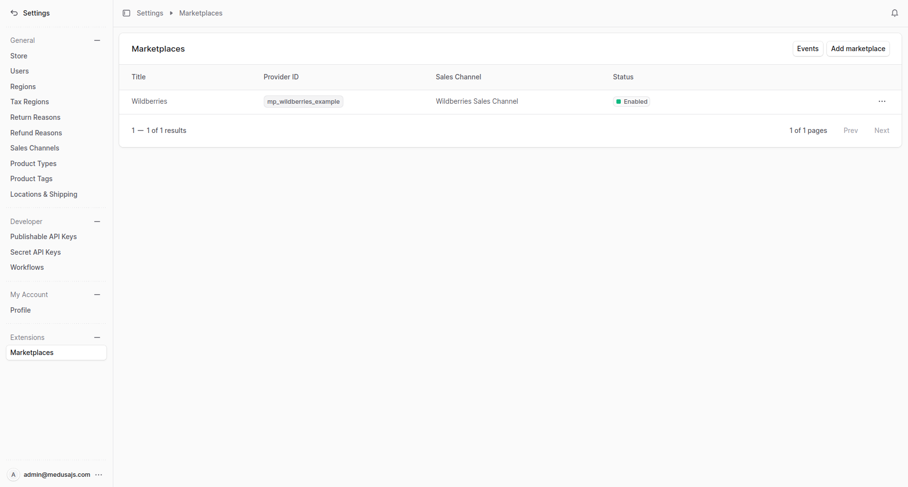
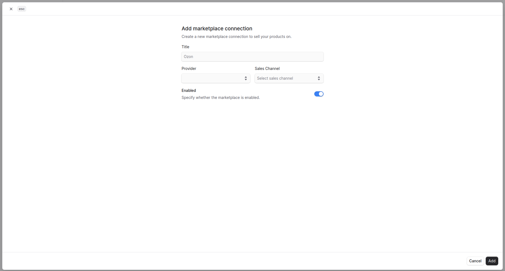

<h1 align="center">
  Интеграция Wildberries с Medusa
</h1>

<p align="center">
  Плагин для Medusa, который интегрирует ваш магазин с маркетплейсом <a href="https://www.wildberries.ru">Wildberries</a>
  <br/>
   <a href="https://github.com/gorgojs/medusa-plugins/blob/HEAD/packages/medusa-integration-wildberries/README.md">Read README in English ↗</a>
</p>

<p align="center">
  <a href="https://medusajs.com">
    
  </a>
  <a href="https://medusajs.com">
    
  </a>
</p>

<p align="center">
  <a href="https://t.me/medusajs_chat">
    
  </a>
</p>

<p align="center">
  <a href="https://t.me/medusajs_chat">
    
  </a>
</p>

## Статус

🚧 В разработке, подробнее см. [Roadmap](https://github.com/gorgojs/medusa-plugins/issues/102).

## Возможности

- 🧩  **Построен как провайдер поверх [`@gorgo/medusa-integration`](https://www.npmjs.com/package/@gorgo/medusa-integration)** с общей админ-панелью, событиями и workflow
- 🔄  **Синхронизация товаров** с Wildberries (создание, обновление, объединение)
- 📦  **Синхронизация заказов** с автоматическим созданием клиентов и заказов
- ⏱  **Плановая и ручная синхронизация** через админ-панель
- 📊  **Логирование событий** для всех операций синхронизации
- 🛠  **Админ UI** для управления интеграциями, доступами и настройками
- 🔑  **Управление API-ключом** через UI
- ⚙️  **Профили обмена** — настройка складов и схем FBS/FBO/DBS

## Требования

- Medusa v2.13.3 или выше
- Node.js v20 или выше
- Core-плагин [@gorgo/medusa-integration](https://www.npmjs.com/package/@gorgo/medusa-integration)  

## Установка

Установите core-плагин Integration и плагин-провайдер Wildberries:

```bash
npm install @gorgo/medusa-integration @gorgo/medusa-integration-wildberries
# или
yarn add @gorgo/medusa-integration @gorgo/medusa-integration-wildberries
```

## Конфигурация

Добавьте конфигурацию провайдера в файл `medusa-config.ts` приложения Medusa Admin:

```ts
// medusa-config.ts
import { gorgoPluginsInject } from '@gorgo/medusa-integration/exports'

module.exports = defineConfig({
  // ...
  // Регистрация плагинов
  plugins: [
    // ...
    // Регистрация плагина Wildberries (добавляет роуты и виджеты в админке)
    {
      resolve: "@gorgo/medusa-integration-wildberries",
      options: {},
    },
   // Регистрация core-плагина integration и объявление провайдера Wildberries
    {
      resolve: "@gorgo/medusa-integration",
      options: {
        providers: [
          {
            resolve: "@gorgo/medusa-integration-wildberries/providers/integration-wildberries",
            id: "wb", // Уникальный идентификатор экземпляра провайдера
            options: {},
          },
        ],
      },
    },
  ],
  // ...
  // Настройка Vite-плагина для внедрения integration-виджетов
  admin: {
    vite: (config) => {
      return {
        ...config,
        plugins: [
          gorgoPluginsInject({
            sources: [
              "@gorgo/medusa-integration",
              "@gorgo/medusa-integration-wildberries",
            ],
          }),
        ],
        /**
         * Параметры `optimizeDeps` и `resolve` необходимы, чтобы избежать дублирования
         * общих зависимостей (React, React Query, React Router) между Medusa admin и пакетами плагинов
         */
        optimizeDeps: {
          exclude: ["@gorgo/medusa-integration"],
        },
        resolve: {
          alias: [
            { find: /^react$/, replacement: require.resolve("react") },
            { find: /^react-dom$/, replacement: require.resolve("react-dom") },
            { find: /^@tanstack\/react-query$/, replacement: require.resolve("@tanstack/react-query") },
            { find: /^react-router-dom$/, replacement: require.resolve("react-router-dom") },
          ],
          dedupe: ["react", "react-dom", "@tanstack/react-query", "react-router-dom"],
          preserveSymlinks: false,
        },
      }
    },
  },
})
```

Компоненты админ-интерфейса внедряются в Medusa Admin с помощью Vite-плагина.

**Параметры плагина `@gorgo/medusa-integration`:**

| Параметр              | Тип      | Обязательный | Описание                                                                                                             |
| --------------------- | -------- | ------------ | -------------------------------------------------------------------------------------------------------------------- |
| `providers`           | `array`  | Yes          | Список регистраций провайдеров интеграций                                                                         |
| `providers[].resolve` | `string` | Yes          | Путь к модулю провайдера. Для Wildberries: `@gorgo/medusa-integration-wildberries/providers/integration-wildberries` |
| `providers[].id`      | `string` | Yes          | Уникальный идентификатор экземпляра провайдера (например, `wb` ), используется для различения нескольких подключений |
| `providers[].options` | `object` | No           | Параметры уровня провайдера (для Wildberries не используются)                                                            |

**Параметры плагина `@gorgo/medusa-integration-wildberries`:**

Указание параметров на уровне регистрации плагина не требуеся. Все настройки интеграции (например, API-ключ) задаются отдельно для каждого подключения в Medusa Admin.

**Параметры плагина Vite `gorgoPluginsInject`:**

| Параметр  | Тип        | Описание                                                                                                                                                               |
| --------- | ---------- | ---------------------------------------------------------------------------------------------------------------------------------------------------------------------- |
| `sources` | `string[]` | Список пакетов Gorgo-плагинов, чьи расширения админ-интерфейса должны быть внедрены в Medusa Admin. Укажите все установленные `@gorgo/medusa-integration-*` NPM-пакеты |

## Разработка

Для генерации [клиента Wildberries OpenAPI](https://openapi-generator.tech/docs/installation/) требуется Docker. Чтобы сгенерировать клиент, выполните:

```bash
yarn
yarn openapi:pull  # загрузить актуальную схему Wildberries OpenAPI
yarn openapi:gen   # сгенерировать API-клиент
```

Клиент также автоматически пересобирается при запуске `yarn dev`.

## Лицензия

MIT

## Использование

Данная документация описывает управление интеграциями с маркетплейсом Wildberries из панели администратора Medusa.

### Управление интеграциями

В этом руководстве вы узнаете, как управлять интеграциями в панели администратора Medusa.

#### Просмотр интеграций

Перейдите в **Настройки → Интеграции**, чтобы увидеть таблицу всех настроенных интеграций с интеграциями.



В таблице отображается:

| Column            | Описание                                                      |
| ----------------- | ------------------------------------------------------------- |
| **Title**         | Отображаемое имя, которое вы присвоили интеграции           |
| **Provider**      | Тип интеграции (например, `wildberries`)                    |
| **Sales Channel** | Канал продаж Medusa, связанный с данной интеграцией         |
| **Status**        | Активна или отключена интеграция                              |

---

#### Добавление интеграции

1. Перейдите в **Настройки → Интеграции**.
2. Нажмите **Добавить**, чтобы создать подключение к интеграции.
3. Заполните форму:
   - **Title** — понятное имя для данного подключения (например, «Wildberries Основной магазин»).
   - **Provider** — выберите `wildberries` из выпадающего списка.
   - **Sales Channel** — выберите канал продаж Medusa, к которому будут относиться товары и заказы данной интеграции.
   - **Enabled** — переключите, чтобы включить или отключить интеграцию.
4. Нажмите **Save**, чтобы создать интеграцию.



> После создания настройте разделы **Credentials** и **Exchange settings** перед запуском синхронизации.

---

#### Просмотр сведений об интеграции

Нажмите на интеграцию в списке, чтобы открыть страницу с подробными сведениями. Страница разделена на несколько секций:

- **General** — название и статус активности.
- **Exchange Profiles** — сопоставление складов и типов заказов.
- **Events** — журнал всех операций синхронизации для данной интеграции.
- **Credentials** — ваш API-ключ Wildberries.

![settings.marketplaces.[id]](../../www/docs/public/static/marketplace-wildberries/image-2.png)

---

#### Редактирование сведений о интеграции

1. На странице сведений о интеграции найдите раздел **General**.
2. Нажмите на значок **Edit** (карандаш).
3. Обновите **Title** или переключите **Enabled**.
4. Нажмите **Save**.

![settings.marketplaces.[id].edit](../../www/docs/public/static/marketplace-wildberries/image-3.png)

---

### Управление учётными данными интеграции

В этом руководстве вы узнаете, как управлять учётными данными Wildberries в панели администратора Medusa.

#### Редактирование учётных данных интеграции

Раздел **Credentials** предоставляется виджетом `@gorgo/medusa-integration-wildberries` на странице сведений об интеграции.

1. Найдите раздел **Credentials** на странице сведений об интеграции.
2. Текущий API-ключ отображается в скрытом виде (показываются первые 4 и последние 2 символа).
3. Нажмите на значок глаза, чтобы показать полный ключ, или нажмите на ключ, чтобы скопировать его в буфер обмена.
4. Нажмите на значок **Edit** (карандаш), чтобы открыть форму редактирования.
5. Введите ваш [API-ключ Wildberries](https://seller.wildberries.ru/supplier-settings/access-to-api) в поле **API Key**.
6. Нажмите **Save**.

![settings.marketplaces.[id].credentials.edit](../../www/docs/public/static/marketplace-wildberries/image-4.png)

> Ваш API-ключ хранится в базе данных и по умолчанию никогда не отображается в открытом виде в интерфейсе администратора.

---

### Управление настройками обмена интеграции

В этом руководстве вы узнаете, как управлять настройками обмена Wildberries в панели администратора Medusa.

#### Редактирование настроек обмена интеграции

Настройки обмена связывают **склад** с **типом заказа** (FBS, FBO, DBS и т.д.). Они необходимы для синхронизации заказов.

1. Найдите раздел **Exchange settings** на странице сведений об интеграции.
2. Нажмите **Add** (или значок редактирования у существующего профиля).
3. Выберите:
   - **Warehouse** — выберите из списка складов, полученных в режиме реального времени из вашего аккаунта Wildberries.
   - **Order Type** — `FBS` (Fulfilled by Seller, выполняется продавцом) или `FBO` (Fulfilled by Operator, выполняется оператором).
4. Нажмите **Save**.

![settings.marketplaces.[id].exchange-settings.edit](../../www/docs/public/static/marketplace-wildberries/image-5.png)

> Список складов загружается из API Wildberries с использованием вашего настроенного API-ключа. Убедитесь, что учётные данные сохранены перед добавлением профиля обмена.

---

### Синхронизация товаров

Товары можно синхронизировать в обоих направлениях:

- **Export** — товары Medusa отправляются в Wildberries. Для товаров без идентификатора Wildberries создаются новые карточки товаров; существующие карточки обновляются по идентификатору номенклатуры (`nmID`). Если товар уже имеет множество вариантов на Wildberries, новые варианты добавляются в существующую карточку.
- **Import** — данные товаров Wildberries (nmID, imtID, SKU размеров) загружаются и сохраняются в виде метаданных для ваших товаров и вариантов в Medusa.

После успешного экспорта или импорта в вариантах устанавливаются следующие поля метаданных:

| Metadata key           | Описание                                                                        |
| ---------------------- | ------------------------------------------------------------------------------- |
| `wildberries_nmID`     | Идентификатор номенклатуры на Wildberries (идентификатор варианта).             |
| `wildberries_imtID`    | Идентификатор материала на Wildberries (идентификатор карточки товара).         |
| `wildberries_sizeSkus` | Массив SKU размеров.                                                            |
| `wildberries_sizeID`   | Идентификатор размера.                                                          |
| `wildberries_error`    | Ошибка валидации от Wildberries, если есть.                                     |

---

#### Ручная синхронизация товаров

1. На странице сведений об интеграции нажмите «Синхронизировать».
2. Выберите «Товары» из выпадающего меню.
3. Синхронизация выполняется в фоновом режиме. Для отслеживания прогресса и результатов проверьте раздел **Events**.

![settings.marketplaces.[id].products-sync](../../www/docs/public/static/marketplace-wildberries/image-6.png)

---

#### Плановая синхронизация товаров

Товары автоматически синхронизируются каждый день в полночь (UTC) с помощью фонового задания `sync-integration-products`. Дополнительная настройка не требуется.

---

### Синхронизация заказов

Заказы импортируются из Wildberries в Medusa. Для каждого заказа Wildberries создаются соответствующий заказ и покупатель в Medusa, если они ещё не существуют. Дублирующиеся заказы пропускаются автоматически.

---

#### Ручная синхронизация заказов

1. На странице сведений об интеграции нажмите «Синхронизировать».
2. Выберите «Заказы» из выпадающего меню.
3. Синхронизация выполняется в фоновом режиме. Для отслеживания прогресса и результатов проверьте раздел **Events**.

![settings.marketplaces.[id].orders-sync](../../www/docs/public/static/marketplace-wildberries/image-7.png)

---

#### Плановая синхронизация заказов

Заказы автоматически синхронизируются каждый день в полночь (UTC) с помощью фонового задания `sync-integration-orders`. Дополнительная настройка не требуется.

---

#### Удаление интеграции

1. На странице сведений об интеграции откройте меню действий.
2. Нажмите «Удалить».
3. Подтвердите удаление.

![settings.marketplaces.[id].delete](../../www/docs/public/static/marketplace-wildberries/image-8.png)

> Удаление интеграции также безвозвратно удаляет все связанные профили обмена и события.

---

#### Просмотр событий

Перейдите в **Настройки → Интеграции → События**, чтобы просмотреть журнал всех операций синхронизации по всем интеграциям. События, относящиеся к конкретной интеграции, также видны на его странице сведений.

![settings.marketplaces.[id].events](../../www/docs/public/static/marketplace-wildberries/image-9.png)

Список событий содержит:

| Column        | Описание                                                                                          |
| ------------- | ------------------------------------------------------------------------------------------------- |
| **Direction** | `Medusa → Integration` (экспорт) или `Integration → Medusa` (импорт).                            |
| **Entity**    | Что синхронизировалось: `PRODUCT`, `PRODUCT_MEDIA`, `PRODUCT_PRICE`, `PRODUCT_STOCK` или `ORDER`. |
| **Action**    | Выполненная операция: `CREATE`, `UPDATE` или `DELETE`.                                            |
| **Started**   | Когда началась операция.                                                                          |
| **Finished**  | Когда завершилась операция.                                                                       |

---

#### Просмотр сведений о событии

Нажмите на любое событие в списке, чтобы открыть подробный просмотр. Здесь отображается:

- **Correlation ID** — группирует связанные события из одного цикла синхронизации (WIP).
- **Direction**, **Entity type** и **Action**.
- Временные метки **Started at** / **Finished at**.
- **Request data** — полная полезная нагрузка, отправленная в Wildberries или полученная от него (JSON).
- **Response data** — полный ответ от Wildberries (JSON), включая любые ошибки валидации, возвращённые API Wildberries.

![settings.marketplaces.[id].events.[event_id]](../../www/docs/public/static/marketplace-wildberries/image-10.png)

> Сведения о событии полезны для диагностики сбоев синхронизации. Ошибки валидации для отдельных карточек товаров хранятся в поле **Response data** и также записываются обратно в поле метаданных `wildberries_error` затронутых вариантов.
