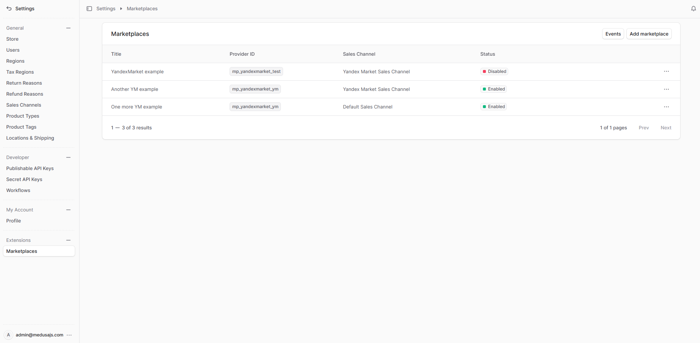
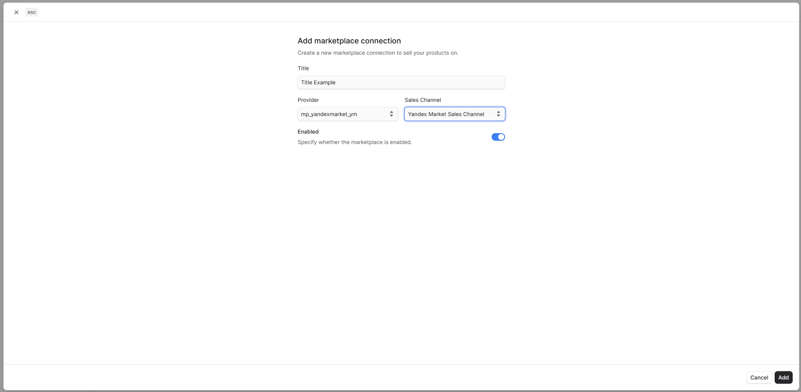

<h1 align="center">
  Интеграция Yandex Market с Medusa
</h1>

<p align="center">
   Плагин для Medusa, который интегрирует ваш магазин с маркетплейсом <a href="https://market.yandex.ru">Yandex Market</a> 
  <br/>
  <a href="https://github.com/gorgojs/medusa-plugins/blob/HEAD/packages/medusa-marketplace-yandex-market/README.md">Read README in English ↗</a>
</p>

<p align="center">
  <a href="https://medusajs.com">
    
  </a>
  <a href="https://medusajs.com">
    
  </a>
</p>

<p align="center">
  <a href="https://t.me/medusajs_chat">
    
  </a>
</p>

<p align="center">
  <a href="https://t.me/medusajs_chat">
    
  </a>
</p>

## Статус

🚧 В разработке, подробнее см. [Roadmap](https://github.com/gorgojs/medusa-plugins/issues/102).

## Возможности

- 🧩  **Построен как провайдер поверх [`@gorgo/medusa-marketplace`](https://www.npmjs.com/package/@gorgo/medusa-marketplace)** с общей админ-панелью, событиями и workflow
- 🔄  **Синхронизация товаров**  с Yandex Market (создание, обновление, объединение)
- 📦  **Синхронизация заказов** с автоматическим созданием клиентов и заказов
- ⏱  **Плановая и ручная синхронизация** через админ-панель
- 📊  **Логирование событий** для всех операций синхронизации
- 🛠  **Админ UI** для управления маркетплейсами, доступами и настройками
- 🔑  **Управление API-ключом** через UI
- ⚙️  **Профили обмена** — настройка складов и схем FBS/FBO/DBS

## Требования

- Medusa v2 (`@medusajs/medusa` >= 2.13.3)  
- Основной плагин маркетплейса [`@gorgo/medusa-marketplace`](https://www.npmjs.com/package/@gorgo/medusa-marketplace)  
- Node.js >= 20  

## Установка

Установите основной плагин Marketplace и плагин-провайдер Yandex Market:

```bash
npm install @gorgo/medusa-marketplace @gorgo/medusa-marketplace-yandex-market

# или
yarn add @gorgo/medusa-marketplace @gorgo/medusa-marketplace-yandex-market
```

## Настройка

Добавьте конфигурацию провайдера в файл `medusa-config.ts` приложения Medusa Admin:

```ts
// medusa-config.ts
import { gorgoPluginsInject } from '@gorgo/medusa-marketplace/exports'

module.exports = defineConfig({
  // ...
  // Регистрация плагинов
  plugins: [
    // ...
    // Регистрация плагина Yandex Market (добавляет роуты и виджеты в админке)
    {
      resolve: "@gorgo/medusa-marketplace-yandex-market",
      options: {},
    },
    // Регистрация основного плагина marketplace и объявление провайдера Yandex Market
    {
      resolve: "@gorgo/medusa-marketplace",
      options: {
        providers: [
          {
            resolve: "@gorgo/medusa-marketplace-yandex-market/providers/marketplace-yandex-market",
            id: "ym", // Уникальный идентификатор экземпляра провайдера
            options: {},
          },
        ],
      },
    },
  ],
  // ...
  // Настройка Vite-плагина для внедрения marketplace-виджетов
  admin: {
    vite: (config) => {
      return {
        ...config,
        plugins: [
          gorgoPluginsInject({
            sources: [
              "@gorgo/medusa-marketplace",
              "@gorgo/medusa-marketplace-yandex-market",
            ],
          }),
        ],
        /**
         * Параметры `optimizeDeps` и `resolve` необходимы, чтобы избежать дублирования
         * общих зависимостей (React, React Query, React Router) между Medusa admin и пакетами плагинов
         */
        optimizeDeps: {
          exclude: ["@gorgo/medusa-marketplace"],
        },
        resolve: {
          alias: [
            { find: /^react$/, replacement: require.resolve("react") },
            { find: /^react-dom$/, replacement: require.resolve("react-dom") },
            { find: /^@tanstack\/react-query$/, replacement: require.resolve("@tanstack/react-query") },
            { find: /^react-router-dom$/, replacement: require.resolve("react-router-dom") },
          ],
          dedupe: ["react", "react-dom", "@tanstack/react-query", "react-router-dom"],
          preserveSymlinks: false,
        },
      }
    },
  },
})
```

Компоненты админ-интерфейса внедряются в Medusa Admin с помощью Vite-плагина.

**Параметры плагина `@gorgo/medusa-marketplace`:**

| Параметр              | Тип      | Обязательно | Описание                                                                                                                      |
| --------------------- | -------- | ----------- | ----------------------------------------------------------------------------------------------------------------------------- |
| `providers`           | `array`  | Да          | Список регистраций провайдеров маркетплейсов.                                                                                 |
| `providers[].resolve` | `string` | Да          | Путь к модулю провайдера. Для Yandex Market: `"@gorgo/medusa-marketplace-yandex-market/providers/marketplace-yandex-market"`. |
| `providers[].id`      | `string` | Да          | Уникальный идентификатор экземпляра провайдера (например `"ym"`). Нужен, если подключено несколько провайдеров.                 |
| `providers[].options` | `object` | Нет         | Опции на уровне провайдера (для Yandex Market не используются).                                                               |

**Параметры плагина `@gorgo/medusa-marketplace-yandex-market`:**

Указание параметров на уровне регистрации плагина не требуется. Все настройки маркетплейса (например, API-ключ) задаются отдельно для каждого подключения в Medusa Admin.

**Параметры плагина Vite `gorgoPluginsInject`:**

| Параметр    | Тип       | Описание                                                                                                                                                           |
| --------- | ---------- | --------------------------------------------------------------------------------------------------------------------------------------------------------------------- |
| `sources` | `string[]` | Список пакетов Gorgo-плагинов, чьи расширения админ-интерфейса должны быть внедрены в Medusa Admin. Укажите все установленные `@gorgo/medusa-marketplace-*` NPM-пакеты |

## Разработка

Для генерации [клиента Yandex Market OpenAPI](https://openapi-generator.tech/docs/installation/) требуется Docker. Чтобы сгенерировать клиент, выполните:

```bash
yarn
yarn openapi:pull  # загрузить актуальную схему OpenAPI Yandex Market
yarn openapi:gen   # сгенерировать API-клиент
```

Клиент также автоматически пересобирается при запуске `yarn dev`.

## Лицензия

MIT

## Использование

Данная документация описывает управление интеграциями с Yandex Market из панели администратора Medusa.

### Управление маркетплейсами

В этом руководстве вы узнаете, как управлять маркетплейсами в панели администратора Medusa.

#### Просмотр маркетплейсов

Перейдите в **Settings → Marketplaces**, чтобы увидеть таблицу всех настроенных интеграций с маркетплейсами.



В таблице отображаются:

| Колонка           | Описание                                             |
| ----------------- | ---------------------------------------------------- |
| **Title**         | Отображаемое имя, которое вы присвоили маркетплейсу  |
| **Provider**      | Тип маркетплейса (например, `yandexmarket`)          |
| **Sales Channel** | Канал продаж Medusa, связанный с данным маркетплейсом |
| **Status**        | Активен или отключён маркетплейс                   |

---

#### Добавление маркетплейса

1. Перейдите в **Settings → Marketplaces**.
2. Нажмите **Add marketplace**, чтобы создать подключение к маркетплейсу.
3. Заполните форму:
   - **Title** — понятное имя для данного подключения (например, «Yandex Market Основной магазин»).
   - **Provider** — выберите `yandexmarket` из выпадающего списка.
   - **Sales Channel** — выберите канал продаж Medusa, к которому будут относиться товары и заказы данного маркетплейса.
   - **Enabled** — переключите, чтобы включить или отключить маркетплейс.
4. Нажмите **Save**, чтобы создать маркетплейс.



> После создания настройте разделы **Credentials** и **Exchange settings** перед запуском синхронизации.

---

#### Просмотр карточки маркетплейса

Нажмите на маркетплейс в списке, чтобы открыть страницу деталей. На ней несколько разделов:

- **General** — название и статус включения.
- **Exchange Profiles** — привязка складов к типам заказов.
- **Events** — журнал операций синхронизации для этого маркетплейса.
- **Credentials** — API-ключ и данные Yandex Market (виджет провайдера `@gorgo/medusa-marketplace-yandex-market`).

![settings.marketplaces.[id]](../../www/docs/public/static/marketplace-yandex-market/image-3.png)

---

#### Редактирование карточки маркетплейса

1. На странице маркетплейса найдите раздел **General**.
2. Нажмите **Edit** (иконка карандаша).
3. Измените **Title** или переключите **Enabled**.
4. Нажмите **Save**.

![settings.marketplace.[id].edit](../../www/docs/public/static/marketplace-yandex-market/image-4.png)

---

### Управление учётными данными маркетплейса

Ниже — как настроить доступы к Yandex Market в Medusa Admin.

![settings.marketplace.[id].edit](../../www/docs/public/static/marketplace-yandex-market/image-5.png)

#### Редактирование учётных данных

Раздел **Credentials** добавляется виджетом `@gorgo/medusa-marketplace-yandex-market` на странице маркетплейса.

1. Откройте раздел **Credentials** на странице маркетплейса.
2. Текущий API-ключ показывается маскированно (видны первые 4 и последние 2 символа).
3. Иконка «глаз» — показать полный ключ; иконка копирования — скопировать в буфер обмена.
4. Нажмите **Edit** (карандаш), чтобы открыть форму.
5. Введите [API-ключ Yandex Market](https://partner.market.yandex.ru/i) в поле **API Key**.
6. Укажите **Business ID** в поле **Business ID** (в кабинете партнёра Маркета).
7. Укажите **Campaign ID** в поле **Campaign ID** (в кабинете партнёра Маркета).
8. Нажмите **Save**.

> Учётные данные хранятся в базе; по умолчанию полный ключ в админке в открытом виде не показывается.

---

### Настройки обмена (Exchange profiles)

Ниже — привязка склада к типу заказа для синхронизации заказов.

#### Редактирование настроек обмена

Профиль обмена сопоставляет **склад** и **тип заказа** (FBS, FBO, DBS и т.д.). Это нужно для синхронизации заказов.

1. На странице маркетплейса откройте раздел **Exchange settings**.
2. Нажмите **Add** или иконку редактирования у существующего профиля.
3. Выберите:
   - **Warehouse** — склад из списка, загружаемого из API Yandex Market в реальном времени.
   - **Order Type** — например `FBS` (отгрузка силами продавца) или `FBO` (отгрузка маркетплейса).
4. Нажмите **Save**.

![settings.marketplaces.[id].exchange-settings.edit](../../www/docs/public/static/marketplace-yandex-market/image-6.png)

> Список складов приходит из API Yandex Market по сохранённому API-ключу. Сначала сохраните **Credentials**, затем добавляйте профиль обмена.

---

### Синхронизация товаров

Товары можно синхронизировать в обе стороны:

- **Export** — товары Medusa отправляются в Yandex Market. Для офферов без `offerId` создаются новые карточки; существующие обновляются по `offerId`.
- **Import** — с Маркета подтягиваются данные (`offerId`, статусы карточек, `marketCategoryId`, `marketCategoryName`) и сохраняются в metadata на продуктах и вариантах Medusa.

После успешного импорта (или синка, который подтягивает данные с Маркета) в metadata записываются поля:

| Ключ | Где хранится | Описание |
| ---- | ------------- | -------- |
| `yandex_market_offer_id` | variant | Идентификатор оффера на Маркете; при выгрузке совпадает с `offerId`, с `product_variant.id` в Medusa. |
| `yandex_market_card_status` | variant | Статус карточки на Маркете (например `NO_CARD_ERRORS`). |
| `yandex_market_category_id` | product | Идентификатор категории Маркета. |
| `yandex_market_category_name` | product | Название категории Маркета. |

---

#### Ручная синхронизация товаров

1. На странице маркетплейса нажмите **Synchronize**.
2. В списке выберите **Products**.
3. Синхронизация выполняется в фоне. Прогресс и результат — в разделе **Events**.

![settings.marketplaces.[id].products-sync](../../www/docs/public/static/marketplace-yandex-market/image-7.png)

---

#### Плановая синхронизация товаров

Товары автоматически синхронизируются каждый день в полночь (UTC) фоновой задачей `sync-marketplace-products`. Дополнительная настройка не требуется.

---

### Синхронизация заказов

Заказы импортируются из Yandex Market в Medusa. Для каждого заказа Маркета при необходимости создаются заказ и запись покупателя в Medusa. Дубликаты заказов пропускаются автоматически.

---

#### Ручная синхронизация заказов

1. На странице маркетплейса нажмите **Synchronize**.
2. В списке выберите **Orders**.
3. Синхронизация выполняется в фоне. Прогресс и результат — в разделе **Events**.

![settings.marketplaces.[id].orders-sync](../../www/docs/public/static/marketplace-yandex-market/image-8.png)

---

#### Плановая синхронизация заказов

Заказы автоматически синхронизируются каждый день в полночь (UTC) задачей `sync-marketplace-orders`. Дополнительная настройка не требуется.

---

#### Удаление маркетплейса

1. На странице маркетплейса откройте меню действий.
2. Нажмите **Delete**.
3. Подтвердите удаление.

![settings.marketplaces.[id].delete](../../www/docs/public/static/marketplace-yandex-market/image-9.png)

> При удалении маркетплейса безвозвратно удаляются связанные профили обмена и события.

---

#### Просмотр событий

Перейдите в **Settings → Marketplaces → Events**, чтобы увидеть журнал синхронизаций по всем маркетплейсам. События конкретного маркетплейса также доступны на его странице.

![settings.marketplaces.[id].events](../../www/docs/public/static/marketplace-yandex-market/image-10.png)

В списке событий:

| Колонка       | Описание                                                                                   |
| ------------- | ------------------------------------------------------------------------------------------ |
| **Direction** | `Medusa → Marketplace` (экспорт) или `Marketplace → Medusa` (импорт).                      |
| **Entity**    | Что синхронизировалось: `PRODUCT`, `PRODUCT_MEDIA`, `PRODUCT_PRICE`, `PRODUCT_STOCK`, `ORDER`. |
| **Action**    | Операция: `CREATE`, `UPDATE` или `DELETE`.                                                |
| **Started**   | Время начала.                                                                              |
| **Finished**  | Время завершения.                                                                          |

---

#### Детали события

Нажмите на событие в списке, чтобы открыть карточку. В ней:

- **Correlation ID** — связывает события одного запуска синхронизации.
- **Direction**, тип сущности (**Entity type**) и **Action**.
- Метки времени **Started at** / **Finished at**.
- **Request data** — полный JSON запроса к API или полученных данных.
- **Response data** — полный JSON ответа Yandex Market, в том числе ошибки валидации.

![settings.marketplaces.[id].events.[event_id]](../../www/docs/public/static/marketplace-yandex-market/image-11.png)

> Детали событий помогают разбирать сбои синхронизации. Ошибки валидации по отдельным карточкам попадают в **Response data** и при необходимости могут дублироваться в metadata вариантов (например, в поле `yandexmarket_error`).
